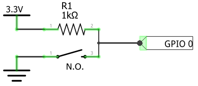

# bBinarySensors Library
## Overview
A bBinarySensor is a specilized version of [bSensor](https://github.com/diy365-mgos/bsensor). It allows you to easily manage bSensors having just binary (true/false) state.
## Features
- **Verbose state** - Optionally, you can configure verbose state instead of default booleans (e.g: 'ON'/'OFF').
- **GPIO as sensors** - You can easily manage GPIO as sensors. Just include the [bThings GPIO library](https://github.com/diy365-mgos/bthing-gpio) in your project.
## GET STARTED
Copy, build and flash one of the following ready-to-use firmwares.
#### Example 1 - Push button
Create a bBinarySensor for reading a *pushed/released* button state. Before running the code sample, you must wire your boardas indicated in the schema below.



Include these libraries in your `mos.yml` file.
```yaml
libs:
  - origin: https://github.com/diy365-mgos/bbinsens
  - origin: https://github.com/diy365-mgos/bthing-gpio
```
```c
#include "mgos.h"
#include "mgos_bthing_gpio.h"
#include "mgos_bbinsens.h"

static int gpio_pin = 0;

static void sensor_state_changed_cb(int ev, void *ev_data, void *userdata) {
  struct mgos_bthing_state *arg = (struct mgos_bthing_state *)ev_data;

  LOG(LL_INFO, ("The button '%s' (on GPIO %d) has been %s.",
    mgos_bthing_get_uid(arg->thing), gpio_pin, mgos_bvar_get_str(arg->state)));
}

enum mgos_app_init_result mgos_app_init(void) {
  mgos_event_add_handler(MGOS_EV_BTHING_STATE_CHANGED, sensor_state_changed_cb, NULL);

  /* create the sensor */
  mgos_bbinsens_t sens = mgos_bbinsens_create("btn1", NULL);
  mgos_bbinsens_set_verbose_state(sens, "PUSHED", "RELEASED");
  /* set sensor interrupt */
  mgos_bsensor_update_on_int(MGOS_BBINSENS_DOWNCAST(sens), gpio_pin, MGOS_GPIO_PULL_UP, MGOS_GPIO_INT_EDGE_ANY, 50);
  /* attach GPIO  */
  mgos_bthing_gpio_attach(MGOS_BBINSENS_THINGCAST(sens), gpio_pin, false, MGOS_GPIO_PULL_UP);
  
  return MGOS_APP_INIT_SUCCESS;
}
```
## Inherited APIs
A bBinarySensor inherits APIs from:
- [bThing](https://github.com/diy365-mgos/bthing)
- [bSensor](https://github.com/diy365-mgos/bsensor)
### Remarks on: mgos_bthing_on_get_state()
The [get-state handler](https://github.com/diy365-mgos/bthing#mgos_bthing_get_state_handler_t) must set `true` or `false` the `state` parameter.
```c
static bool my_get_state_handler(mgos_bthing_t thing, mgos_bvar_t state, void *userdata) {
  bool sensor_state;
  // sensor_state = ... get the physical sensor state (true or false)
  mgos_bvar_set_bool(state, sensor_state);
  return true;
}
mgos_bbinsens_t sens = mgos_bbinsens_create(...);
mgos_bthing_on_get_state(MGOS_BBINSENS_THINGCAST(sens), my_get_state_handler, NULL);
```
### Remarks on: mgos_bthing_get_state()
The [mgos_bthing_get_state()](https://github.com/diy365-mgos/bthing#mgos_bthing_get_state) returns a boolean value or a string value in case [verbose state](#mgos_bbinsens_set_verbose_state) is configured. Alternatively you can use the [mgos_bbinsens_get_state()](#mgos_bbinsens_get_state) helper function.
```c
// standard state
mgos_bbinsens_t sens = mgos_bbinsens_create(...);
mgos_bvarc_t state = mgos_bthing_get_state(MGOS_BBINSENS_THINGCAST(sens));
bool sens_state = mgos_bvar_get_bool(state);

// verbose state
mgos_bbinsens_t sens = mgos_bbinsens_create(...);
mgos_bbinsens_set_verbose_state(sens, "ON", "OFF");
mgos_bvarc_t state = mgos_bthing_get_state(MGOS_BBINSENS_THINGCAST(sens));
const char *sens_state = mgos_bvar_get_str(state);
```
## C/C++ APIs Reference
### MGOS_BBINSENS_TYPE
```c
#define MGOS_BBINSENS_TYPE
```
The bBinarySensor type ID. It can be used with [mgos_bthing_is_typeof()](https://github.com/diy365-mgos/bthing#mgos_bthing_is_typeof).

Example:
```c
mgos_bbinsens_t sens = mgos_bbinsens_create(...);
if (mgos_bthing_is_typeof(MGOS_BBINSENS_THINGCAST(sens), MGOS_BBINSENS_TYPE))
  LOG(LL_INFO, ("I'm a bBinarySensor."));
if (mgos_bthing_is_typeof(MGOS_BBINSENS_THINGCAST(sens), MGOS_BSENSOR_TYPE))
  LOG(LL_INFO, ("I'm a bSensor."));
if (mgos_bthing_is_typeof(MGOS_BBINSENS_THINGCAST(sens), MGOS_BTHING_TYPE_SENSOR))
  LOG(LL_INFO, ("I'm a bThing sensor."));
```
Output console:
```bash
I'm a bBinarySensor.
I'm a bSensor.
I'm a bThing sensor.
```
### MGOS_BBINSENS_THINGCAST
```c
mgos_bthing_t MGOS_BBINSENS_THINGCAST(mgos_bbinsens_t sensor);
```
Casts a bBinarySensor to a generic bThing to be used with [inherited bThing APIs](https://github.com/diy365-mgos/bthing).

|Parameter||
|--|--|
|sensor|A bBinarySensor.|

Example:
```c
mgos_bbinsens_t sens = mgos_bbinsens_create(...);
LOG(LL_INFO, ("%s successfully created.", mgos_bthing_get_uid(MGOS_BBINSENS_THINGCAST(sens)));
```
### MGOS_BBINSENS_DOWNCAST
```c
mgos_bsensor_t MGOS_BBINSENS_DOWNCAST(mgos_bbinsens_t sensor);
```
Casts a bBinarySensor to a bSensor to be used with [inherited bSensor APIs](https://github.com/diy365-mgos/bsensor).

|Parameter||
|--|--|
|sensor|A bBinarySensor.|
### mgos_bbinsens_create
```c
mgos_bbinsens_t mgos_bbinsens_create(const char *id, const char *domain);
```
Creates a bBinarySensor. Returns `NULL` on error.

|Parameter||
|--|--|
|id|The bBinarySensor ID.|
|domain|The domain name or `NULL`.|
### mgos_bbinsens_get_state
```c
bool mgos_bbinsens_get_state(mgos_bbinsens_t sensor, bool *state);
```
Gets the binary state of a bBinarySensor. Returns `true` on success, or `false` otherwise. This is an helper function for [mgos_bthing_get_state()](https://github.com/diy365-mgos/bthing#mgos_bthing_get_state).

|Parameter||
|--|--|
|sensor|A bBinarySensor.|
|state|The output binary state.|
### mgos_bbinsens_set_verbose_state
```c
bool mgos_bbinsens_set_verbose_state(mgos_bbinsens_t sensor,
                                    const char *payload_true,
                                    const char *payload_false);
```
Enables verbose state of a bBinarySensor. Returns `true` on success, or `false` otherwise.

|Parameter||
|--|--|
|sensor|A bBinarySensor.|
|payload_true|The string payload for `true` state.|
|payload_false|The string payload for `false` state.|

**Remarks**

When verbose state are enabled, methods like [mgos_bthing_get_state()](https://github.com/diy365-mgos/bthing#mgos_bthing_get_state) return string states instead of booleans.
### mgos_bbinsens_state_verbose
```c
bool mgos_bbinsens_state_verbose(mgos_bbinsens_t sensor);
```
Returns `true` if the bBinarySensor is configured for using verbose state, or `false` otherwise.

|Parameter||
|--|--|
|sensor|A bBinarySensor.|
### mgos_bbinsens_state_parse
```c
bool mgos_bbinsens_state_parse(mgos_bbinsens_t sensor,
                               mgos_bvarc_t state,
                               bool *out_state);
```
Parses and converts the provided state to the boolean representation. Returns `true` if success, or `false` otherwise.

|Parameter||
|--|--|
|sensor|A bBinarySensor.|
|state|A bBinarySensor's state.|
|out_state|Output parsed state.|
## To Do
- Implement javascript APIs for [Mongoose OS MJS](https://github.com/mongoose-os-libs/mjs).
